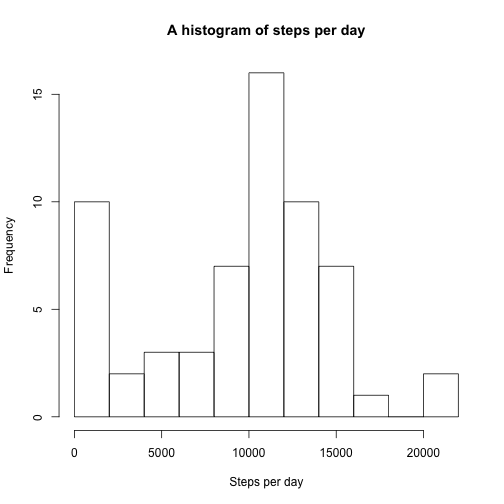
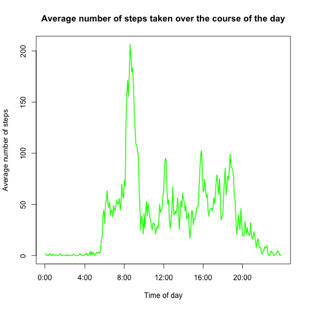
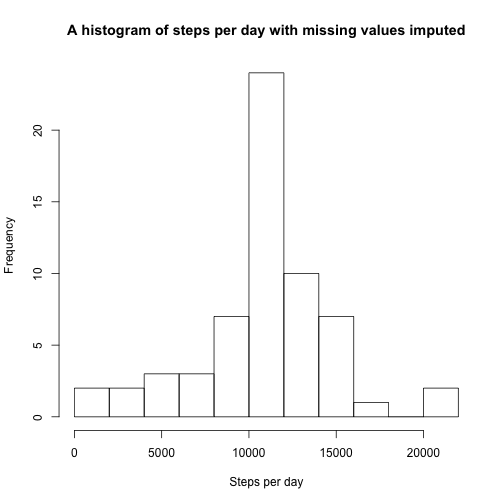
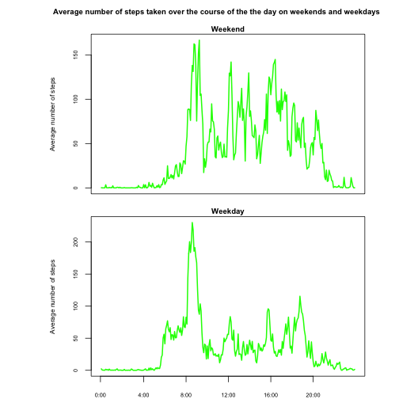

This is my first R markdown document!

Here are the packages we will need to do this:

###Loading and processing the data

First we are going to download the data, unzip it, and read it into R


```r
    fileURL <- "https://d396qusza40orc.cloudfront.net/repdata%2Fdata%2Factivity.zip"
    download.file(fileURL, destfile="activity.zip", method = "curl")
    activity <- read.csv(suppressWarnings(unz("activity.zip", "activity.csv")))
```

###What is the mean total number of steps taken per day?

The next task is to make a histogram of the total number of steps taken each day, and then calculate and report the mean and median of the total number of steps taken each day. To do this, we need to use tapply to create a vector that contains the sum of the steps taken each day, plot a histogram of that vector, and then calculate the mean and median of that vector. I used the base graphics for the histogram but increased the number of breaks. 


```r
    stepsperday <- tapply(activity$steps, activity$date, sum, na.rm = TRUE)
    hist(stepsperday, breaks=15, main = "A histogram of steps per day", xlab= "Steps per day")
```

 

```r
    print(paste0("The mean is ", as.integer(mean(stepsperday)), " and the median is ", median(stepsperday)))
```

```
## [1] "The mean is 9354 and the median is 10395"
```

###What is the average daily activity pattern?

Now we want to look at the average pattern of steps taken in a day by averaging all the steps in a given time interval, using tapply again. Because the interval identifiers are not a simple sequence of 5 minute intervals(they are the time of day, but without a colon), I am going to plot the average number of steps per interval against the indices of the interval vector, and then label the x-axis with the actual time of day corresponding to the interval using the axis command. Then I will provide the identifier of the interval with the greatest number of steps on average, and provide the corresponding time of day from the index of the vector.


```r
    stepsperinterval <- tapply(activity$steps, activity$interval, mean, na.rm = TRUE)
    plot(stepsperinterval, type="l", xaxt="n", xlab="Time of day", ylab= "Average number of steps", col="green" , lwd=2) 
    title(main="Average number of steps taken over the course of the day")
    axis(1, labels = c('0:00', '4:00', '8:00', '12:00', '16:00', '20:00'), at = c(0, 49, 97, 145, 193, 241))
```

 

```r
    print(paste0("The interval with the most steps is identified as ", names(which.max(stepsperinterval)), " and corresponds to the 5-minute interval starting at ", (which.max(stepsperinterval))%/%12, ":", (((which.max(stepsperinterval))%%12)-1)*5    ))
```

```
## [1] "The interval with the most steps is identified as 835 and corresponds to the 5-minute interval starting at 8:35"
```

###Imputing missing values

Our dataframe has a lot of missing values! We need to count how many.


```r
   print(paste0("Our dataset has a total of ", sum(is.na(activity)), " missing values."))
```

```
## [1] "Our dataset has a total of 2304 missing values."
```

Now we need to fill in these missing values with something plausible. I like the idea of using the number of steps in each time interval averaged over 61 days. I calculated this previously and called it stepsperinterval. I make a new vector by repeating the stepsperinterval vector 61 times and call it NAreplace. Then every NA value in the activity$steps vector can be replaced by the corresponding value in NAreplace. A more elegant coder would not explicitly create the intermediate vectors!


```r
   NAreplace <- rep(stepsperinterval, times = 61)
   activity$steps[which(is.na(activity$steps))] <- NAreplace[which(is.na(activity$steps))]
   print(paste0("Now we have ", sum(is.na(activity$steps)), " NA values in our activity dataset"))
```

```
## [1] "Now we have 0 NA values in our activity dataset"
```

The code chunk above has overwritten all the NAs in the dataframe. Let's see if that made any difference. We're going to redo the histogram of steps per day and see if the mean and median have changed. I will simply copy that code block.


```r
    stepsperday <- tapply(activity$steps, activity$date, sum)
    hist(stepsperday, breaks=15, main = "A histogram of steps per day with missing values imputed", xlab= "Steps per day")
```

 

```r
    print(paste0("The new mean is ", as.integer(mean(stepsperday)), " and the new median is ", as.integer(median(stepsperday))))
```

```
## [1] "The new mean is 10766 and the new median is 10766"
```

The mean has increased but the median has stayed the same. This suggests that the missing values skewed the results lower. You can also see that the histogram no longer shows a large frequency of very low values of steps per day.

###Are there activity differences between weekdays and weekends?
If we convert the activity$date column to POSIXlt format, then it contains information on the day of the week under the heading wday. So I made a vector, whichday, that contains the wday values for the POSIXlt-formatted dates in my data frame, and I coerced it to factor. The wday vales are 0:6, with 0 being Sunday and 6 being Saturday. I then replace all the values between 1 and 5 (corresponding to Monday through Friday) with "weekday", and then replace everything else (i.e. the 0s and 6s) with the "weekend". Then I attach it to my dataframe using cbind.


```r
    whichday <- as.POSIXlt(activity$date)$wday
    whichday[whichday >= 1 & whichday < 6] <- "weekday"
    whichday[whichday != "weekday"] <- "weekend"
    activity <- cbind(activity, whichday)
```

Now I want to calculate the average steps per interval separately for weekdays and weekends. I am going to use the aggregate function to take the mean of the steps per interval averaged over all weekend days and then again over all weekday days. That gives me a data frame with 576 rows, with 1 to 288 being the weekday values and 289-576 being the weekend values. My calculated value for the mean number of steps per interval within each type of day is in the third column. I am going to use base plotting and indexing; in other words, one plot will contain the first 288 values and the second will contain the remaining 288 values.


```r
    stepsperinterval <- aggregate(activity$steps ~ activity$interval + activity$whichday, data = activity, mean)
    par(mfrow = c(2,1))
    par(mar = c(1, 4, 1, 2), oma = c(1, 4, 2, 1), cex = 1, cex.axis = 0.6, cex.main = 0.8, cex.lab = 0.7)
    plot(stepsperinterval[289:576,3], type="l", xaxt="n", xlab="", ylab= "Average number of steps", main = "Weekend", col="green" , lwd=2) 
    plot(stepsperinterval[1:288,3], type="l", xaxt="n", xlab="Time of day", ylab= "Average number of steps", main = "Weekday", col="green" , lwd=2) 
    axis(1, labels = c('0:00', '4:00', '8:00', '12:00', '16:00', '20:00'), at = c(0, 49, 97, 145, 193, 241))
    title(main="Average number of steps taken over the course of the the day on weekends and weekdays", outer = TRUE)
```

 

Clearly our subject has activity patterns that are different on weekends compared to weekdays!
